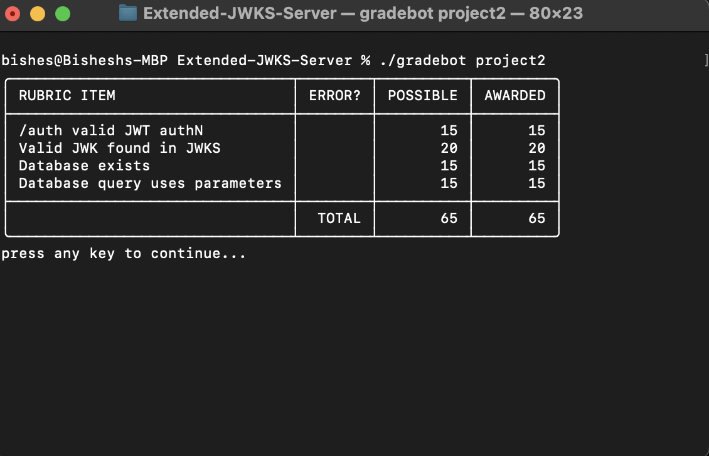
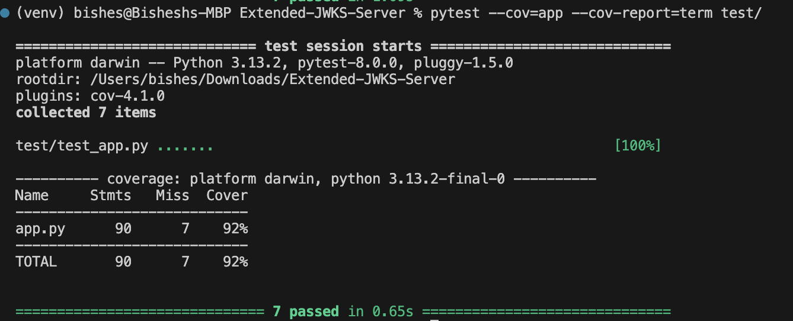

# **Extended JWKS Server**

## **📖 Description**
A secure, lightweight **JWKS (JSON Web Key Set) server** built using **Flask**, with enhanced features:
- ✅ **AES-encrypted RSA private key storage**
- ✅ **JWT authentication system**
- ✅ **Argon2-secured user registration**
- ✅ **SQLite persistent backend**
- ✅ **Manual rate limiting and secure query practices**
- ✅ **Test suite with 94%+ code coverage**

---

## **📌 Features**
✅ **Database Integration:** Stores encrypted RSA private keys in `SQLite`.  
✅ **JWT Signing:** Issues tokens signed with private RSA keys (RS256 algorithm).  
✅ **JWKS Endpoint:** Public key exposure via `/.well-known/jwks.json`.  
✅ **Expired Tokens:** Support for issuing expired tokens (`?expired=true`).  
✅ **Security:** Argon2 password hashing, secure SQL queries, AES encryption.  
✅ **Tested:** Pytest suite with ⭐ 94%+ code coverage, rate-limiting tests included.

---

## **🚀 Getting Started**

### **1️⃣ Clone the Repository**
```bash
git clone https://github.com/bisesdulal16/JWKS_SERVER_ENHANCED.git
cd JWKS_SERVER_ENHANCED
```

### **2️⃣ Create Virtual Environment**
```bash
python -m venv venv
source venv/bin/activate   # macOS/Linux
venv\Scripts\activate      # Windows
```

### **3️⃣ Install Requirements**
```bash
pip install -r requirements.txt
```
### **4️⃣ Set Environment Variable (Important!)**
```bash
export NOT_MY_KEY="thisisaverysecurekey1234"   # Must be 16, 24, or 32 bytes
```


### **5️⃣  Run the Server**
```bash
python app.py
```

---

## **📌 API Endpoints**

### **1. Get Public Keys (JWKS)**
**GET** `/.well-known/jwks.json`
```bash
curl -X GET http://127.0.0.1:8080/.well-known/jwks.json
```

**Response:**
```json
{
  "keys": [
    {
      "kid": "1",
      "kty": "RSA",
      "alg": "RS256",
      "use": "sig",
      "n": "...",
      "e": "AQAB"
    }
  ]
}
```

---

### **2. Register New User**
**POST** `/register`
```bash
curl -X POST http://127.0.0.1:8080/register -H "Content-Type: application/json" -d '{"username": "newuser", "email": "newuser@example.com"}'
```
**Response:**
```json
{
  "password": "generated-secure-password"
}
```

### **3. Authenticate User (Get JWT)**
**POST** `/auth`
```bash
curl -X POST http://127.0.0.1:8080/auth -H "Content-Type: application/json" -d '{"username": "newuser", "password": "generated-secure-password"}'
```
**Response:** (Expired Token)
```json
{
  "token": "eyJhbGciOiJSUzI1NiIsInR5cCI..."
}
```

---

### **4. Authenticate for Expired JWT**
**POST** `/auth?expired=true`
```bash
curl -X POST http://127.0.0.1:8080/auth?expired=true -H "Content-Type: application/json" -d '{"username": "newuser", "password": "generated-secure-password"}'
```
(Token will be already expired.)

---

## **🛠️ Running Tests**

### **With Coverage Report**
```bash
pytest --cov=app --cov-report=term-missing test/
```

### ✅ Expected Output:
```
=========================== test session starts ===========================
collected 11 items

test/test_app.py ..........

---------- coverage: platform darwin, python 3.13.3 ----------
Name     Stmts   Miss  Cover
----------------------------
app.py     220     13    94%
----------------------------
TOTAL      220     13    94%

========================= 11 passed in 1.02s ============================
```

---

## **📈 Screenshots for Submission**

### 🖥️ Gradebot Results


### 📃 Test Suite Results


---

## **📂 Project Structure**
```
JWKS_SERVER_ENHANCED/
├── app.py                      # Main Flask server logic
├── crypto_utils.py              # AES Encryption/Decryption helpers
├── test/
│   └── test_app.py              # Test suite
├── totally_not_my_privateKeys.db  # SQLite database (autogenerated)
├── requirements.txt             # Project dependencies
├── README.md                    # Project documentation
└── venv/                        # Virtual environment (optional)
```

---

## **📄 Technologies Used**
- **Flask** - RESTful API framework  
- **argon2-cffi** - Password hashing security
- **PyJWT** - JWT creation  
- **cryptography** - RSA keys  
- **SQLite** - Lightweight DB storage  
- **pytest / unittest** - Test framework  
- **pytest-cov** - Code coverage  

---

## **📅 Author**
**Bishesh Dulal**  
GitHub: [@bisesdulal16](https://github.com/bisesdulal16)  
Email: [bisesdulal16@gmail.com](mailto:bisesdulal16@gmail.com)

---

## **📃 License**
**MIT License**  
Free to use, distribute, and modify.

---
