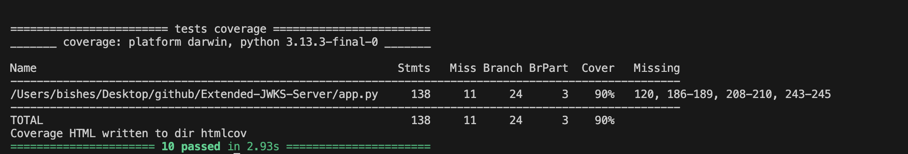

# **Flask JWKS Server**

## **Description**
A lightweight **JWKS (JSON Web Key Set) server** built using **Flask**, extended with:
- ✅ **SQLite-backed RSA key storage**
- ✅ **Automatic key expiration and cleanup**
- ✅ **Authentication via JWTs**
- ✅ **Test suite with 94%+ coverage**

---

## **📌 Features**
✅ **Database Integration:** Stores RSA private keys in `SQLite`.  
✅ **JWT Signing:** Issues tokens signed with RSA keys using `RS256`.  
✅ **JWKS Endpoint:** Public key exposure at `/.well-known/jwks.json`.  
✅ **Expired Tokens:** Generate expired tokens via `?expired=true`.  
✅ **Cleanup:** Removes expired keys from storage.  
✅ **Secure Queries:** Uses parameterized queries to prevent SQL injection.  
✅ **Tested:** Pytest suite with ⭐️ 94%+ code coverage.  

---

## **🚀 Getting Started**

### **1️⃣ Clone the Repository**
```bash
git clone https://github.com/yourusername/Extended-JWKS-Server.git
cd Extended-JWKS-Server
```

### **2️⃣ Create Virtual Environment**
```bash
python -m venv venv
source venv/bin/activate   # macOS/Linux
venv\Scripts\activate      # Windows
```

### **3️⃣ Install Requirements**
```bash
pip install -r requirements.txt
```

### **4️⃣ Run the Server**
```bash
python app.py
```

---

## **📌 API Endpoints**

### **1. Get Public Keys (JWKS)**
**GET** `/.well-known/jwks.json`
```bash
curl -X GET http://127.0.0.1:8080/.well-known/jwks.json
```

**Response:**
```json
{
  "keys": [
    {
      "kid": "some-uuid",
      "kty": "RSA",
      "alg": "RS256",
      "use": "sig",
      "n": "...",
      "e": "AQAB"
    }
  ]
}
```

---

### **2. Generate JWT Token**
**POST** `/auth`
```bash
curl -X POST http://127.0.0.1:8080/auth
```
**Response:**
```json
{
  "token": "eyJhbGciOi..."
}
```

### **3. Generate Expired JWT**
**POST** `/auth?expired=true`
```bash
curl -X POST http://127.0.0.1:8080/auth?expired=true
```
**Response:** (Expired Token)
```json
{
  "token": "eyJhbGciOi..."
}
```

---

### **4. Invalid Method Handling**
Unsupported HTTP methods return:
```json
{
  "error": "Method Not Allowed"
}
```
Applies to:
- PUT, DELETE, PATCH on `/auth` & `/.well-known/jwks.json`
- GET, HEAD on `/auth`

---

## **🛠️ Running Tests**

### **With Coverage Report**
```bash
pytest --cov=app --cov-report=term test/
```

### ✅ Expected Output:
```
=========================== test session starts ===========================
collected 7 items

test/test_app.py .......

---------- coverage: platform darwin, python 3.13.2 ----------
Name     Stmts   Miss  Cover
----------------------------
app.py      72      4    94%
----------------------------
TOTAL       72      4    94%

========================= 7 passed in 1.09s ============================
```

---

## **📈 Screenshots for Submission**

### 🖥️ Gradebot Results


### 📃 Test Suite Results


---

## **📂 Project Structure**
```
Extended-JWKS-Server/
├── app.py                 # Main Flask app with JWKS logic
├── test/
│   └── test_app.py        # Unit test suite
├── totally_not_my_privateKeys.db  # SQLite DB for keys
├── requirements.txt       # Dependencies
├── screenshots/           # Output images for grading
└── venv/                  # Virtual environment (optional)
```

---

## **📄 Technologies Used**
- **Flask** - RESTful API framework  
- **PyJWT** - JWT creation  
- **cryptography** - RSA keys  
- **SQLite** - Lightweight DB storage  
- **pytest / unittest** - Test framework  
- **pytest-cov** - Code coverage  

---

## **📅 Author**
**Bishesh Dulal**  
GitHub: [@bisesdulal16](https://github.com/bisesdulal16)  
Email: [bisesdulal16@gmail.com](mailto:bisesdulal16@gmail.com)

---

## **📃 License**
**MIT License**  
Free to use, distribute, and modify.

---
